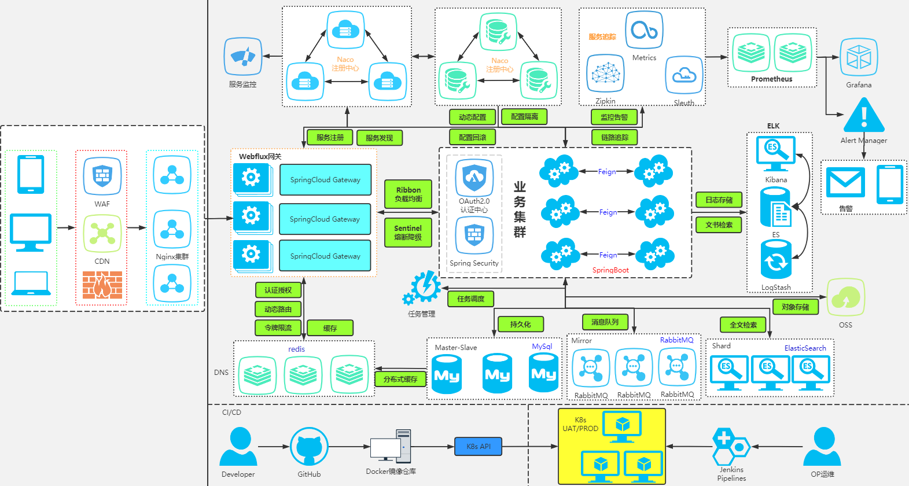
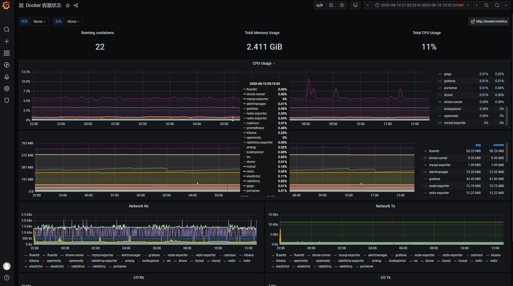

# shoulder-platform

## 简介：

`shoulder-platform` 是一个 `SaaS` 平台（仅实现基础能力，不包含具体业务），代码简洁，架构清晰，非常适合学习使用。

## 架构图

在线工具：[https://app.diagrams.net/](https://app.diagrams.net/) [https://processon.com/](https://processon.com/)

## 在线预览

- [开发规范地址](spec.itlym.cn)
- [Grafana + Prometheus 监控系统](grafana.itlym.cn)（访客账号密码：`shoulder` / `shoulder123`，仅包含仪表盘查看权限）
- [EFK 日志系统](kibana.itlym.cn)（访客账号密码：`shoulder` / `shoulder123`，仅包含日志检索查看权限）
- 平台地址( 开发中 )
- ~~[zipkin 链路追踪系统](zipkin.itlym.cn)（暂时下线）~~

# 能力介绍

- 能力概览
	- 单点登录
    - 用户管理
	- 资源权限管理
    - 通知推送中心（短信、邮件）
    - 错误码中心（查询错误码，大概产生原因，解决措施）
    - 知识库(记录常见问题排查方式等）
    - 在线 api 文档中心
    
- 核心框架
    - `SpringBoot` 
    - `SpringCloud`
    - `Shoulder Framework`
    - 服务认证: Spring Security（Oauth、JWT）

- 微服务治理方案选型
    - 服务注册、服务发现: nacos
    - 服务调用: feign + 负载均衡: Ribbon / Dubbo
    - 限流 & 断路器: Sentinel
    - 配置中心:nacos
    - 消息通知
        - rabbitMQ、KafKa
    - 文件存储
        - ceph、OSS..
    - 分布式任务调度
        - Power Job
    - 分布式事务
        - Seata
    - 数据同步
        - canal
    - 监控
        - 集群监控：spring-boot-actuator + spring-boot-admin
        - 服务监控：sentinel
        - 链路追踪：zipkin/Skywalking（根据部署机器性能选择）
        - 指标监控：metrics + exporter + prometheus + grafana
        - 主机监控、容器监控：cAdvisor
        - 告警：alertManager
        - 日志监控 EFK（Elastic Search + Fluentd + Kibana）
    - 持续集成、持续部署（不限制）
        - 版本控制：Git
        - 接口文档：openApi3
        - 代码审查：Sonar
        - 自动测试：AutoTest
        - 持续集成：Maven、Jenkins、Drone
        - 部署：Docker、K8s
        - 发布方式：金丝雀发布、蓝绿发布、灰度发布（Ribbon）
    - 数据智能
        - ETL：
        - 数据处理：Flink、Google Data Flow、Beam
   

- 认证中心
    - 单点登录
    - 会话管理
    - 授权管理
    
- 用户中心
    - 用户、组织、人事管理
    - 租户管理
    
- 权限中心
    - 菜单权限
    - 角色权限
    - 岗位管理
    - 资源管理
    - 应用管理
    
- 消息推送
    - 短信
    - 邮件
    - 钉钉
    - 企业微信
    - App（第三方）

- 平台
    - 用户平台
    - 监控门户
    - 运维平台
    - 运营平台（后台管理）
    
- 网关
    - Web 浏览器
    - H5 小程序
    - App
    - OpenApi
    - 静态资源
    
## 启动与使用

- IDEA
- jar
- docker
    
## 如果觉得对您有帮助，请点右上角 "Star" 支持一下吧，谢谢！

## 文档

## 展示

#### 监控

## 项目代码地址

| 项目 | 开源地址 | 说明 |
|---|---|---|
| Shoulder Framework | [github](https://github.com/ChinaLym/Shoulder-Framework)、[gitee](https://gitee.com/ChinaLym/shoulder-framework) | 开发框架，在 Spring Boot 基础之上，结合[软件优雅设计与开发最佳实践](http://spec.itlym.cn)，增加常用的功能，任何基于`Spring Boot`/`Spring Cloud`的项目都可以使用。 |
| Shoulder Platform | [github](https://github.com/ChinaLym/Shoulder-Platform)、[gitee](https://gitee.com/ChinaLym/shoulder-Platform) | SaaS 开发平台，提供了基础通用能力，与具体业务无关 |
| shoulder-framework-demo | [github](https://github.com/ChinaLym/shoulder-framework-demo)、[gitee](https://gitee.com/ChinaLym/shoulder-framework) | 以简单的例子介绍 `Shoulder Framework` 的使用 |
| shoulder-plugins | [github](https://github.com/ChinaLym/shoulder-plugins)、[gitee](https://gitee.com/ChinaLym/shoulder-plugins) | shoulder 提供的的减少开发工作量的`maven`插件（非必须，如遵循[软件优雅设计与开发最佳实践-国际化开发](http://doc.itlym.cn/specs/base/i18n.html)时推荐希望使用自动生成多语言翻译资源文件的插件减少开发工作量） |
| shoulder-lombok | [github](https://github.com/ChinaLym/shoulder-lombok)、[gitee](https://gitee.com/ChinaLym/shoulder-lombok) | 在`lombok`之上，增加 `@SLog` 注解，用于简化[软件优雅设计与开发最佳实践-错误码与日志](http://spec.itlym.cn/specs/base/errorCode.html) -shoulder 实现的日志框架的使用（非必须） |
| shoulder-lombok-idea-plugin | [github](https://github.com/ChinaLym/lombok-intellij-plugin)、[gitee](https://gitee.com/ChinaLym/lombok-intellij-plugin) | 在 `lombok-idea-plugin`之上，在 IDEA 中增加`@SLog`的编码提示，以更好的使用 `shoulder-lombok`（非必须，使用 shoulder-lombok 时推荐） |
